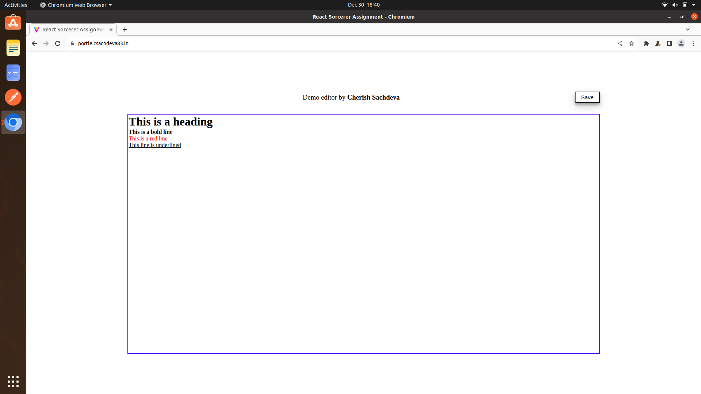

# ReactJS Editor with Draft.js

## Live Demo

A live demo of the application can be accessed [here](https://portle.csachdeva83.in/).

## Components

-   **Title:** Displays the title of the editor.
-   **Button:** Allows users to save the content of the editor.
-   **Editor:** Utilizes Draft.js for text input and formatting.

## Formatting Options

-   **Headings:** Typing `#` as the first character in a line followed by a space sets the text on the same line as a heading.
-   **Bold:** Typing `*` as the first character in a line followed by a space makes the subsequent text bold.
-   **Red Line:** Using `**` followed by a space creates a red line format.
-   **Underline:** Typing `***` followed by a space underlines the text.

## Usage

-   **Typing**: Use the specified characters followed by a space to activate formatting.
-   **Save Button**: Pressing the "Save" button stores the content into `localstorage`.
-   **Persistence**: The saved content is retrieved from `localstorage` upon page refresh, refilling the editor.

## How to Run

1. Clone this repository.
2. Install dependencies using `npm install`.
3. Run the project using `npm run dev`.

## Screenshot

## Hosting

The application is hosted at Digital Ocean.
